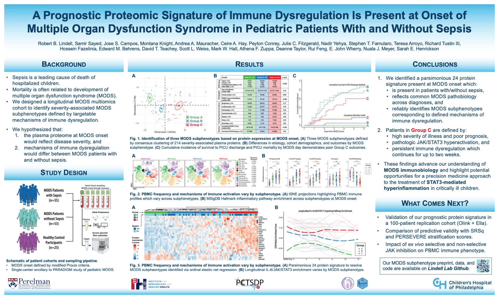

<!-- README.md is generated from README.Rmd. Please edit that file -->

<h1>Dysregulated STAT3 signaling and T cell immunometabolic dysfunction
define a targetable, high mortality subphenotype of pediatric critical
illness
</h1>

Sepsis is the leading cause of death of hospitalized children
worldwide.

Despite the established link between immune dysregulation and
mortality in pediatric sepsis, <b>it remains unclear which host immune
factors contribute causally to adverse sepsis outcomes.</b> Identifying
modifiable pathobiology is an essential first step to successful
translation of biologic insights into precision therapeutics.

We designed a prospective, longitudinal cohort study of 88 critically
ill pediatric patients with multiple organ dysfunction syndrome (MODS),
including patients with and without sepsis, to define <b>subphenotypes
associated with targetable mechanisms of immune dysregulation.</b>

<h2>ATS Presentation</h2>

<h2>Preprint</h2>

We expect to post a preprint on <i>medRxiv</i> on June 4, 2024.

<h2>Data</h2>

Data will be posted at the time of publication.

<h2>Code</h2>

Code will be posted at the time of publication.

